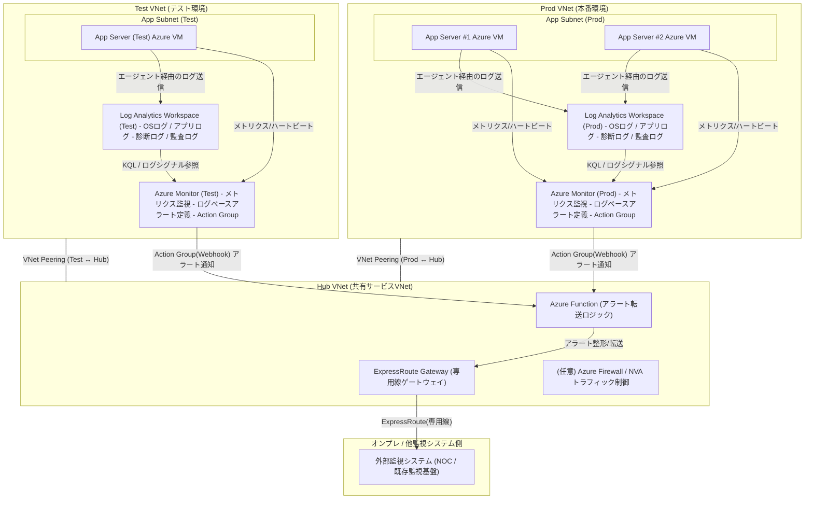

論理アーキテクチャ図

```mermaid
flowchart TB
    %% オンプレ側
    subgraph OnPrem["オンプレ / 他監視システム側"]
        NMS["外部監視システム (NOC / 既存監視基盤)"]
    end

    %% Hub (共通サービスVNet)
    subgraph Hub["Hub VNet (共有サービスVNet)"]
        ER["ExpressRoute Gateway (専用線ゲートウェイ)"]
        AFN["Azure Function (アラート転送ロジック)"]
        AFW["(任意) Azure Firewall / NVA トラフィック制御"]
    end

    %% Prod環境
    subgraph Prod["Prod VNet (本番環境)"]
        subgraph Prod-App["App Subnet (Prod)"]
            VM1["App Server #1 Azure VM"]
            VM2["App Server #2 Azure VM"]
        end
        LAP["Log Analytics Workspace (Prod) - OSログ / アプリログ - 診断ログ / 監査ログ"]
        MONP["Azure Monitor (Prod) - メトリクス監視 - ログベースアラート定義 - Action Group"]
    end

    %% Test環境
    subgraph Test["Test VNet (テスト環境)"]
        subgraph Test-App["App Subnet (Test)"]
            VMt1["App Server (Test) Azure VM"]
        end
        LAT["Log Analytics Workspace (Test) - OSログ / アプリログ - 診断ログ / 監査ログ"]
        MONT["Azure Monitor (Test) - メトリクス監視 - ログベースアラート定義 - Action Group"]
    end

    %% データ収集系フロー（Prod）
    VM1 -- メトリクス/ハートビート --> MONP
    VM2 -- メトリクス/ハートビート --> MONP
    VM1 -- エージェント経由のログ送信 --> LAP
    VM2 -- エージェント経由のログ送信 --> LAP
    LAP -- KQL / ログシグナル参照 --> MONP

    %% データ収集系フロー（Test）
    VMt1 -- メトリクス/ハートビート --> MONT
    VMt1 -- エージェント経由のログ送信 --> LAT
    LAT -- KQL / ログシグナル参照 --> MONT

    %% アラート発火 → 転送
    MONP -- "Action Group(Webhook) アラート通知" --> AFN
    MONT -- "Action Group(Webhook) アラート通知" --> AFN

    %% Functionからオンプレ
    AFN -- "アラート整形/転送" --> ER
    ER -- "ExpressRoute(専用線)" --> NMS

    %% VNet間接続
    Prod ---|"VNet Peering (Prod ↔ Hub)"| Hub
    Test ---|"VNet Peering (Test ↔ Hub)"| Hub
```
